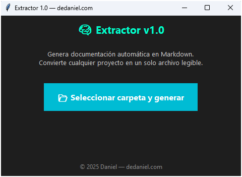

# 🧰 Extractor


> 🧾 *Extrae el contenido de cualquier proyecto y genera un único archivo .txt con todos sus archivos dentro.*

---

## ⚡ Descripción

**Extractor** es una herramienta simple y útil para desarrolladores, estudiantes y creadores de proyectos.  
Permite recorrer carpetas completas y **volcar todo su contenido en un solo archivo `.txt`**, facilitando la lectura, documentación o análisis de código.  

Ideal para preparar proyectos antes de compartirlos, hacer backups de contenido o generar informes para IA y revisores de código.

---

## 🚀 Características

- 📂 Selección de carpetas o rutas específicas  
- 📜 Genera un único archivo `extract.txt` con todo el contenido  
- 🔍 Filtra extensiones si se desea (ej: `.py`, `.html`, `.js`, `.sql`, etc.)  
- 💬 Indica automáticamente nombre de archivo y ruta  
- 🧠 Perfecto para análisis con IA o documentación rápida  
- 💾 Versión `.exe` disponible (no requiere instalación)

---

## 🖼️ Vista previa



---

## 🧠 Ejemplo de salida

```
# === Archivo: src/server.js ===
const express = require('express');
const app = express();

# === Archivo: db/init.sql ===
CREATE TABLE users (...);
```

---

## 💾 Descargar versión compilada (.exe)

[](https://github.com/Dasge97/extractor/releases/download/v1.0/Extractor.zip)

> No requiere instalación.  
> Solo ejecútalo, elige la carpeta y genera tu archivo `extract.txt` con un clic.

---

## 🧰 Ejecutar desde el código fuente

```bash
# 1. Clonar el repositorio
git clone https://github.com/TU_USUARIO/extractor.git
cd extractor/src

# 2. (Opcional) Crear entorno virtual
python -m venv .venv
.\.venv\Scripts\activate

# 3. Instalar dependencias
pip install -r requirements.txt

# 4. Ejecutar
python extractor.py
```

---

## 🧱 Estructura del proyecto

```
extractor/
├─ src/
│   ├─ extractor.py
│   └─ requirements.txt
├─ dist/
│   └─ Extractor.exe
├─ README.md
├─ LICENSE
└─ .gitignore
```

---

## 🪄 Uso típico

1. Ejecuta **Extractor**.  
2. Elige una carpeta raíz.  
3. Espera unos segundos mientras analiza los archivos.  
4. Obtendrás un archivo `extract.txt` con el contenido completo y ordenado.  

> Ideal para entregar prácticas, analizar código con IA o generar documentación técnica sin perder contexto.

---

## 🧾 Release oficial v1.0

- 🎉 Versión inicial estable  
- 📁 Soporte para lectura recursiva de carpetas  
- ⚙️ Salida organizada por nombre de archivo  
- 🚀 Versión `.exe` incluida para Windows

---

## 🪪 Licencia

Distribuido bajo licencia **MIT** — libre para uso personal o profesional.  
Consulta el archivo [LICENSE](LICENSE) para más detalles.

---

## 💬 Autor

Desarrollado por **Daniel** 🧑‍💻  

---

⭐ *Si esta herramienta te resulta útil, deja una estrella en el repositorio :)*
